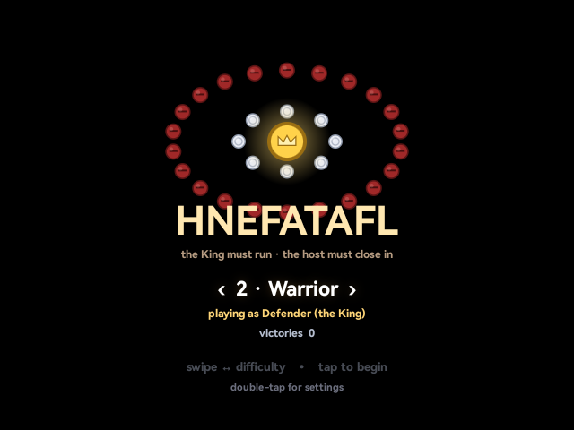
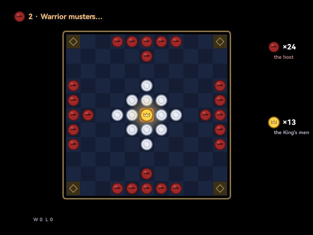

# X3Hnefatafl

X3Hnefatafl brings Hnefatafl, the asymmetric Viking board game often called "Viking chess," to the RayNeo X3 Pro AR glasses. A lone King and his small ring of guards stand besieged at the center of an 11×11 board by a much larger host of attackers; the King tries to reach any corner while the attackers try to surround and capture him on all four sides. The rules follow the classic Fetlar variant, with custodial capture (sandwiching a piece between two of your own) and orthogonal, rook-like movement for every piece. The engine, AI, and sound are all synthesized at runtime with no bundled assets, and the computer opponent offers five difficulty tiers from Thrall through Konungr, each running an alpha-beta search tuned with an asymmetric evaluation that reflects the King's need to reach open ground versus the host's need to box him in.

## Screenshots

  
  

## Controls (right temple pad)

| Gesture | Action |
|---|---|
| Swipe ↑ ↓ ← → | Move the cursor one square (menus: navigate) |
| Click (temple tap) | Lift a piece · place it · confirm |
| Double-tap | Open / close settings any time |

## Download

[X3Hnefatafl.apk](X3Hnefatafl.apk)
